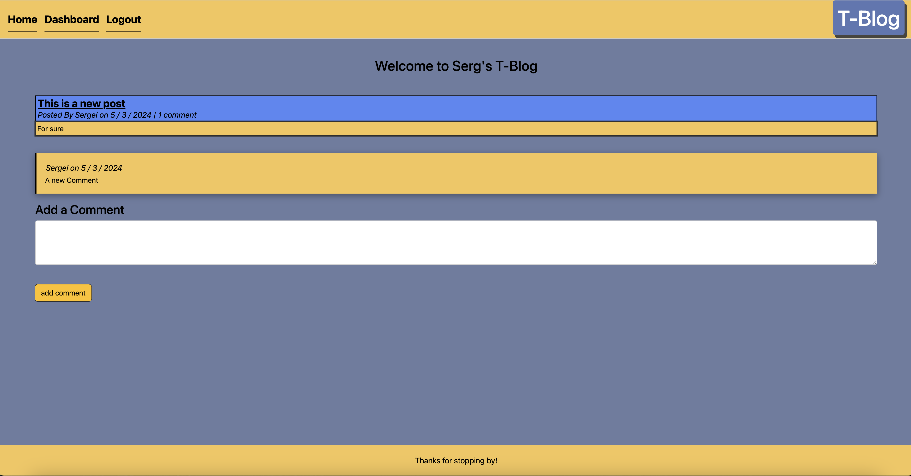

# T-Blog

## Description

A blog designed to allow users to make posts, and comment on other people's posts. Users are able to see the posts of everone else without logging in, but
a sign up and login is required to be able to post and comment.

Editing of your own posts is also allowed when loggeding 

## Table of Contents (Optional)

- [Installation](#installation)
- [Usage](#usage)
- [Credits](#credits)
- [License](#license)

## Installation

No installation is required as the app is online on Heroku

## Usage

Using the navigation bar above, user can go back between home, dashboard, and login / signup pages. Login in is required to be able to comment and post

## Credits

All work is done by Sergei Malyshka

## License

---